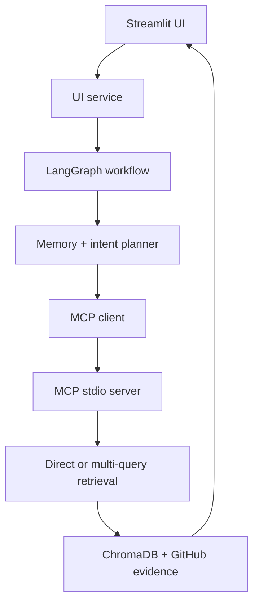

# ProjectPulse AI

ProjectPulse AI is an agentic RAG system for investigating changing software-project history. It accepts natural-language project questions, detects the query intent, selects a retrieval route through LangGraph, invokes retrieval capabilities across a real MCP `stdio` process boundary, and presents grounded GitHub evidence in a Streamlit interface.

The current MVP is intentionally evidence-first. It shows what the system retrieved, how it routed the query, which investigation queries it generated, and what memory it used. It does not yet add an LLM answer-synthesis layer, so generated conclusions are never presented as if they were supported facts.

## Current MVP

Implemented and verified:

- GitHub commit, issue, and pull-request ingestion
- normalized project-document storage
- document chunking and local ChromaDB indexing
- semantic retrieval with `all-MiniLM-L6-v2`
- deterministic intent detection and multi-query investigation planning
- evidence aggregation and deduplication
- two read-only ProjectPulse MCP tools
- LangGraph conditional routing
- bounded short-term conversation memory
- selective JSON-backed long-term memory
- LangSmith tracing across orchestration, MCP tool invocation, planning, and retrieval
- Streamlit chat-style investigation UI
- 50 automated tests

## Architecture



Focused questions use:

`Streamlit -> LangGraph -> search_project_history -> MCP -> semantic retrieval`

Status, changes, blockers, timelines, features, and pull-request questions use:

`Streamlit -> LangGraph -> investigate_project -> MCP -> planning -> multi-query retrieval -> evidence aggregation`

## Repository Structure

```text
Project-Pulse-AI/
├── data/
│   └── github_documents.json
├── docs/
│   ├── progress.md
│   └── project_scope.md
├── src/projectpulse/
│   ├── agentic_retriever.py
│   ├── chunker.py
│   ├── github_client.py
│   ├── langgraph_agent.py
│   ├── mcp_client.py
│   ├── mcp_server.py
│   ├── memory.py
│   ├── planner.py
│   ├── retriever.py
│   ├── ui_service.py
│   └── vector_store.py
├── tests/
├── streamlit_app.py
└── requirements.txt
```

## Local Setup — Windows PowerShell

ProjectPulse was developed with Python `3.10.10`.

```powershell
cd D:\projectpulse-ai

Set-ExecutionPolicy -Scope Process -ExecutionPolicy Bypass

python -m venv .venv
.\.venv\Scripts\Activate.ps1

python -m pip install --upgrade pip
python -m pip install -r requirements.txt
```

If the existing `.venv` is already active, only the final install command is required to add the Streamlit dependency.

### Optional environment configuration

Copy `.env.example` to `.env` and provide GitHub credentials when running live ingestion:

```powershell
Copy-Item .env.example .env
```

LangSmith tracing is optional. To enable it for the current PowerShell session:

```powershell
$env:LANGSMITH_TRACING = "true"
$env:LANGSMITH_API_KEY = "your-key"
$env:LANGSMITH_PROJECT = "projectpulse-ai-dev"
```

Do not commit `.env` or API keys.

## Build the Local Retrieval Index

`data/chroma/` is a machine-local runtime index and is excluded from Git. Build it once after cloning:

```powershell
$env:PYTHONPATH = "$PWD\src"
python -m projectpulse.vector_store
```

The committed development corpus currently contains two normalized GitHub documents, so the resulting index is intentionally small.

## Run the Streamlit UI

From the repository root:

```powershell
streamlit run streamlit_app.py
```

The app opens in the browser and supports:

- typed project questions
- sample investigation prompts
- configurable evidence depth
- visible intent and MCP tool selection
- investigation sub-queries
- ranked evidence cards with GitHub source links
- short-term session context
- selective long-term memory indicators
- raw tool output for debugging
- clearing visible chat and temporary session context

Clearing the chat does not delete persistent long-term memory. The runtime memory file is stored at `data/projectpulse_memory.json` and is excluded from Git.

## Run Tests

```powershell
Remove-Item Env:PYTHONPATH -ErrorAction SilentlyContinue
pytest -v
```

Latest verified result:

`50 passed`

The suite covers ingestion, chunking, planning, agentic evidence collection, LangGraph routing, memory, UI-service formatting and wiring, and the initial Streamlit render.

## Measured Retrieval Baseline

The current two-document development corpus produced:

- evaluation queries: `4`
- Hit@1: `1.000`
- MRR: `1.000`

This is only a development sanity check. The corpus is too small to support a production-quality retrieval claim.

In the initial baseline-versus-agentic experiment:

| Metric | Baseline | Agentic |
|---|---:|---:|
| Average unique evidence chunks | 2.00 | 2.00 |
| Total retrieval calls | 3 | 13 |
| Average latency | 52.64 ms | 199.17 ms |

Agentic query decomposition did not expand unique evidence coverage because both routes ultimately searched the same two indexed chunks. The experiment identified corpus coverage—not planning—as the immediate bottleneck.

## Known Limitations

- The indexed corpus contains only two evidence chunks.
- The UI presents retrieved evidence rather than an LLM-synthesized final answer.
- Tool selection is deterministic rather than produced by native LLM tool calling.
- Long-term-memory classification is rule based.
- Long-term-memory retrieval uses token overlap rather than semantic embeddings.
- Cross-process LangSmith context is not yet propagated as one distributed trace across the MCP `stdio` boundary.
- Local embedding-model initialization can add noticeable cold-start latency.

These limitations are documented explicitly so the repository does not claim capabilities or accuracy that have not been implemented and measured.

## Documentation

- [`docs/project_scope.md`](docs/project_scope.md) — original scope and design
- [`docs/progress.md`](docs/progress.md) — implementation history, issues, decisions, tests, and measured experiments
